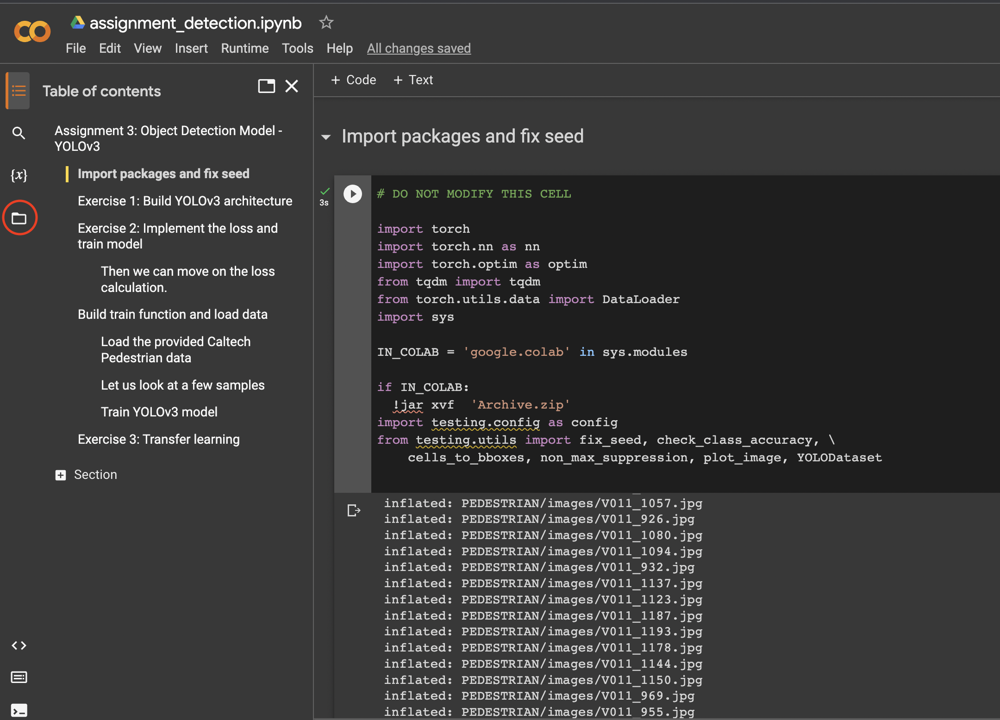
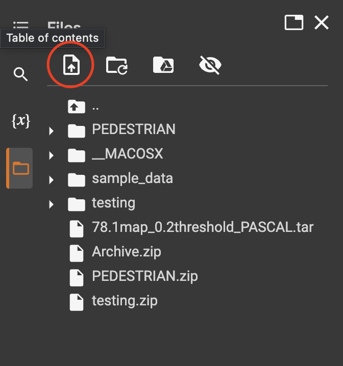

# Deep Learning Detection Assignment

## Important!!

Before running this notebook, you will need to download the dataset and weights from Canvas. If you want to use this notebook in Google Colab make sure to follow the instructions bellow.

1. Upload your notebook to Colab
2. Upload the archive you downloaded from canvas. You should upload `Detection_weights_dataset.zip`.
    1. Click on the folder button on the left in Colab.

    

    2. Click on the upload button and select `Detection_weights_dataset.zip` from your computer.

    
    
3. Everything is set up. You should be able to run the notebook as you would normally.